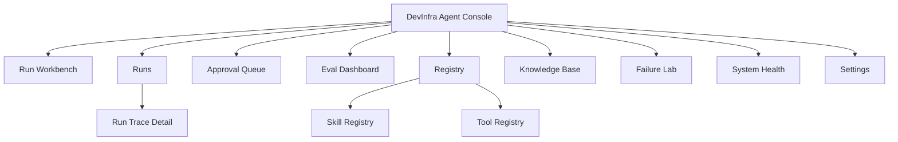
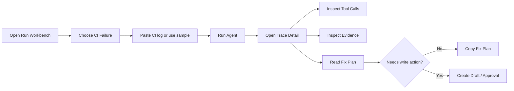
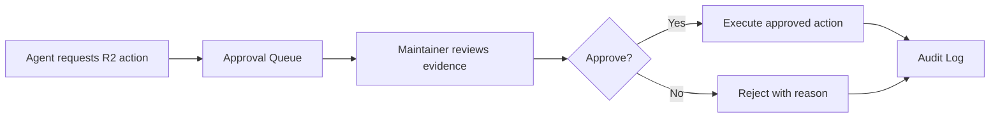
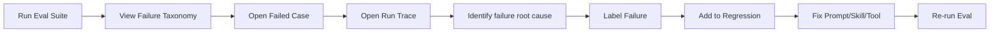

# 企业级研发与运维 Agent 平台前端设计 PRD

> 文档目标：为 `AI Native DevInfra Agent Platform` 设计一套可落地的前端控制台。本文覆盖前端需求、信息架构、页面原型图、组件设计、交互状态、权限表现、API 依赖、验收标准和实现顺序。

## 1. 文档信息

| 项目 | 内容 |
|---|---|
| 前端产品名 | DevInfra Agent Console |
| 所属项目 | AI Native DevInfra Agent Platform |
| 前端定位 | 面向研发与 SRE 的 Agent 工程控制台 |
| 目标用户 | 研发工程师、SRE、测试工程师、技术负责人、平台管理员 |
| 核心任务 | 提交 Agent 任务、观察运行链路、审批高风险动作、评测 Agent 效果、管理 Skills / Tools / Knowledge |
| 设计形态 | 桌面优先的 SaaS / DevTools 控制台 |
| 技术栈 | React + TypeScript + Vite + TanStack Query + React Router + Recharts/ECharts + React Flow |
| 设计风格 | 克制、信息密集、偏工程工具；避免营销页、聊天玩具和装饰性视觉 |

## 2. 产品设计 Brief

### 2.1 一句话目标

让研发和 SRE 能在一个控制台里提交真实工程任务，看到 Agent 如何拆解、检索、调用工具、触发审批和生成结果，并让 Agent 开发者能通过评测与回放持续改进系统。

### 2.2 前端必须证明的能力

| 能力 | 前端如何体现 |
|---|---|
| Agent Runtime | Run Trace 中展示 router、planner、executor、verifier、finalizer |
| Tool Calling | Trace 中展示工具名称、参数摘要、耗时、结果和失败 |
| MCP | Tool Registry 中区分 local tools、service tools、MCP tools |
| Skills | Skill Registry 中展示 skill schema、allowed tools、risk level、版本 |
| 权限控制 | Approval Queue 中展示风险等级、审批状态、操作范围和审计记录 |
| 上下文管理 | Trace 中展示 working context、retrieved chunks、evidence pack |
| Agent Harness | Eval Dashboard 中展示 eval suite、grader、replay、失败分类 |
| 可观测性 | Run Detail 和 System Health 中展示 trace、latency、error、cost、tool success rate |
| 生产意识 | Health 页展示 Postgres、Redis、Qdrant、MCP server、worker、队列状态 |

### 2.3 设计原则

- 首屏就是工作台，用户进来就能提交任务。
- 信息密度高，但每个区块只服务一个判断。
- 所有 Agent 结论必须能追溯到 evidence。
- 高风险操作必须先看到风险、参数和影响面，再审批。
- Trace 默认看摘要，细节按需展开。
- 面试 Demo 路径必须 5 分钟内跑完。
- 前端不直接接外部系统，只调用 FastAPI Gateway。

## 3. 用户角色与权限

| 角色 | 首页默认视图 | 可操作范围 | 禁止操作 |
|---|---|---|---|
| Viewer | Run Workbench | 提交只读任务、查看自己的 run、查看公共 eval summary | 审批、执行写工具、修改 skill/tool |
| Developer | Run Workbench | 运行诊断任务、查看 trace、创建工单草稿、标注失败 case | 直接执行 R2/R3 操作 |
| Maintainer | Approval Queue | 审批 R2 动作、运行 eval suite、查看团队 runs | 修改系统级策略 |
| Admin | System Health | 管理 skill/tool registry、查看审计、配置工具健康检查 | 无，但 R3 仍默认 blocked |

前端权限表现：

- 不可操作按钮禁用，并显示原因。
- R2 操作显示 `Requires approval`。
- R3 操作显示 `Blocked in demo mode`。
- 每个审批卡片展示 `requested by`、`skill`、`tool`、`risk`、`idempotency key`。

## 4. 信息架构

### 4.1 页面分层



### 4.2 路由规划

| 路由 | 页面 | 优先级 | 说明 |
|---|---|---|---|
| `/runs/new` | Run Workbench | P0 | 首屏，提交任务 |
| `/runs` | Run List | P1 | 历史任务列表 |
| `/runs/:runId` | Run Trace Detail | P0 | 查看运行链路和结果 |
| `/approvals` | Approval Queue | P0 | 审批高风险动作 |
| `/evals` | Eval Dashboard | P0 | 评测与回归 |
| `/registry/skills` | Skill Registry | P1 | 查看 skill 定义 |
| `/registry/tools` | Tool Registry | P1 | 查看工具状态和 schema |
| `/knowledge` | Knowledge Base | P1 | 导入和测试知识库 |
| `/failure-lab` | Failure Lab | P1 | 标注失败并加入回归集 |
| `/health` | System Health | P1 | 系统组件健康状态 |
| `/settings` | Settings | P2 | 模型、密钥、阈值配置展示 |

### 4.3 全局布局原型

```text
┌──────────────────────────────────────────────────────────────────────────────┐
│ DevInfra Agent Console                     [Env: local] [Role: Developer ▾] │
├───────────────┬──────────────────────────────────────────────────────────────┤
│ New Run       │ Breadcrumb / Page title                         [Run Eval]   │
│ Runs          ├──────────────────────────────────────────────────────────────┤
│ Approvals     │                                                              │
│ Evals         │                     Page Content                              │
│ Registry      │                                                              │
│ Knowledge     │                                                              │
│ Failure Lab   │                                                              │
│ Health        │                                                              │
└───────────────┴──────────────────────────────────────────────────────────────┘
```

布局要求：

- 左侧导航固定宽度 `240px`，支持折叠。
- 顶栏高度 `56px`，展示环境、用户角色、全局运行状态。
- 主内容最大宽度不限，工程控制台使用全宽布局。
- 页面不使用大 hero，不使用营销式卡片堆叠。
- 主要列表使用表格或紧凑行，不把每行都做成大卡片。

## 5. 视觉系统

### 5.1 视觉方向

关键词：工程化、可信、可追踪、低噪音、高密度。

界面应该像 Datadog、Linear、GitHub Actions、LangSmith、Grafana 这类工作台，而不是 AI 聊天产品。

### 5.2 颜色

| Token | 用途 | 建议色 |
|---|---|---|
| `--bg` | 页面背景 | `#f7f8fa` |
| `--surface` | 主表面 | `#ffffff` |
| `--surface-muted` | 次级表面 | `#f1f4f7` |
| `--text` | 主文本 | `#17202a` |
| `--text-muted` | 次级文本 | `#5d6b7a` |
| `--border` | 分隔线 | `#d9e0e7` |
| `--accent` | 主操作 | `#2563eb` |
| `--success` | 成功 | `#16803c` |
| `--warning` | 警告/审批 | `#b7791f` |
| `--danger` | 高风险/失败 | `#c2410c` |
| `--info` | 检索/提示 | `#0f766e` |

### 5.3 字体与字号

| 场景 | 字号 | 字重 |
|---|---:|---:|
| 页面标题 | 20px | 600 |
| 区块标题 | 15px | 600 |
| 正文 | 14px | 400 |
| 表格 | 13px | 400 |
| Trace / code / log | 12px | 400, monospace |
| Badge | 12px | 500 |

### 5.4 组件风格

- Border radius 统一 `6px`。
- 列表区使用轻分隔线，避免厚重阴影。
- 主按钮使用实心蓝色，危险操作使用 outline + danger。
- 图标使用 Lucide，例如 `Play`、`GitBranch`、`ShieldCheck`、`Activity`、`Database`、`Wrench`、`AlertTriangle`。
- Trace、log、tool args 使用 monospace + 可折叠代码块。

## 6. 全局组件需求

| 组件 | 用途 | 页面 |
|---|---|---|
| `AppShell` | 顶栏、侧边栏、内容容器 | 全局 |
| `RoleSwitcher` | Demo 模式切换角色 | 全局 |
| `EnvironmentBadge` | local/staging/prod 模式提示 | 全局 |
| `RunTypeSelector` | 选择 CI / Alert / Issue / Search | Run Workbench |
| `EvidencePanel` | 展示引用证据 | Run Detail |
| `TraceTimeline` | 展示 Agent 步骤 | Run Detail |
| `ToolCallRow` | 工具调用行 | Run Detail / Tool Registry |
| `RiskBadge` | R0/R1/R2/R3 风险标记 | 多页面 |
| `ApprovalCard` | 待审批动作 | Approval Queue |
| `EvalScoreCard` | 评测分数 | Eval Dashboard |
| `FailureTaxonomyChart` | 失败分类图 | Eval Dashboard |
| `SkillSpecViewer` | 展示 Skill YAML/JSON | Skill Registry |
| `ToolSchemaViewer` | 展示 Tool schema | Tool Registry |
| `HealthCheckGrid` | 系统组件状态 | System Health |

## 7. P0 页面设计

## 7.1 Run Workbench

### 用户目标

用户输入一个工程任务，选择或自动识别 workflow，启动 Agent run，并在同页看到初步状态。

### 页面需求

| 需求 | 优先级 | 验收标准 |
|---|---|---|
| 支持选择任务类型 | P0 | CI Failure、Incident Alert、Issue Plan、Context Search 四类 |
| 支持粘贴输入 | P0 | 大文本输入支持 CI 日志、告警、Issue、自然语言问题 |
| 支持示例数据 | P0 | 一键填入 mock case，方便 Demo |
| 支持高级参数 | P0 | repo、service、time window、model、dry run |
| 提交后创建 run | P0 | 调用 `POST /api/runs` |
| 展示实时状态 | P0 | pending、running、waiting_approval、completed、failed |
| 提供跳转 Trace | P0 | run 创建后跳转 `/runs/:runId` 或在右侧预览 |

### 页面原型

```text
┌──────────────────────────────────────────────────────────────────────────────┐
│ Run Workbench                                             [Use sample case]  │
├──────────────────────────────────────────────────────────────────────────────┤
│ Workflow                                                                   │
│ [CI Failure] [Incident Alert] [Issue Plan] [Context Search]                 │
│                                                                            │
│ Input                                                                      │
│ ┌────────────────────────────────────────────────────────────────────────┐  │
│ │ Paste failed CI log, alert payload, GitHub issue, or engineering query │  │
│ │ ...                                                                    │  │
│ └────────────────────────────────────────────────────────────────────────┘  │
│                                                                            │
│ Context                                                                    │
│ Repo [backend-api ▾]   Service [payment-service ▾]   Window [30m ▾]        │
│ Model [qwen-plus ▾]    Mode [Dry run ✓]              Risk [Read-only]      │
│                                                                            │
│ [Run Agent] [Validate Input]                                                │
├───────────────────────────────────────────────┬──────────────────────────────┤
│ Recent Runs                                   │ Starter Checklist            │
│ run_128  CI Failure       completed   24s     │ ✓ Tool registry reachable    │
│ run_127  Alert            approval    31s     │ ✓ Qdrant connected           │
│ run_126  Issue Plan       failed      12s     │ ✓ Eval smoke passed          │
└───────────────────────────────────────────────┴──────────────────────────────┘
```

### 交互细节

| 交互 | 行为 |
|---|---|
| 选择 workflow | 更新 placeholder、context fields 和 sample case |
| 点击 Use sample case | 填入对应 mock 数据 |
| 点击 Validate Input | 本地检查必填字段，不调用 Agent |
| 点击 Run Agent | 创建 run，按钮进入 loading |
| 创建成功 | Toast 显示 run id，跳转 Trace Detail |
| 创建失败 | 显示错误原因和 retry |

### 状态设计

| 状态 | 展示 |
|---|---|
| Empty | 显示四类任务说明和 sample case |
| Loading | Run Agent 按钮 loading，输入锁定 |
| Error | 表单顶部显示错误，保留用户输入 |
| Success | 跳转到 Trace Detail |
| Unauthorized | 禁用提交，提示当前角色权限不足 |

### API 依赖

| API | 用途 |
|---|---|
| `GET /api/skills` | 获取可用 workflows |
| `POST /api/runs` | 创建 run |
| `GET /api/runs` | 获取 recent runs |
| `GET /api/health/components` | 获取 starter checklist |

## 7.2 Run Trace Detail

### 用户目标

用户能看清一次 Agent run 从输入到输出的完整链路：选择了什么 skill、拆了哪些步骤、调了哪些工具、用了哪些证据、是否触发权限、最后结论是否可信。

### 页面需求

| 需求 | 优先级 | 验收标准 |
|---|---|---|
| 展示 run 摘要 | P0 | status、skill、risk、latency、cost、model、user |
| 展示 Trace 时间线 | P0 | router、planner、tool calls、retrieval、verifier、finalizer |
| 展示工具调用详情 | P0 | tool name、args summary、status、latency、result summary |
| 展示 RAG evidence | P0 | source、chunk、score、引用内容 |
| 展示权限决策 | P0 | allowed、draft-only、approval-required、blocked |
| 展示最终结果 | P0 | conclusion、evidence、next steps、test plan |
| 支持导出 | P1 | 导出 JSON 或 markdown report |
| 支持加入失败集 | P1 | 标注失败原因并加入 eval dataset |

### 页面原型

```text
┌──────────────────────────────────────────────────────────────────────────────┐
│ Run run_128  CI Failure Triage                         [Re-run] [Export]     │
│ Status: completed  Skill: triage_ci_failure  Risk: R0  Latency: 24s Cost: ¥0.12 │
├───────────────────────────────┬──────────────────────────────────────────────┤
│ Trace Timeline                 │ Final Result                                 │
│ ● Router        320ms          │ Failure type                                 │
│   skill=triage_ci_failure      │ unit test failure in payment validator        │
│ ● Planner       1.1s           │                                              │
│   5 steps generated            │ Evidence                                     │
│ ● Tool          840ms          │ 1. ci log line 214: AssertionError            │
│   ci.get_failed_logs           │ 2. diff: src/payment/validator.py             │
│ ● Tool          620ms          │ 3. runbook: payment-test-failures.md          │
│   github.get_pr_diff           │                                              │
│ ● Retrieval     730ms          │ Suggested fix                                │
│   3 chunks returned            │ - update null-currency branch                 │
│ ● Verifier      980ms          │ - add regression test                         │
│ ● Finalizer     1.4s           │                                              │
│                                │ [Create ticket draft] [Add to eval dataset]   │
├───────────────────────────────┴──────────────────────────────────────────────┤
│ Tool Call Details                                                            │
│ ci.get_failed_logs  success  840ms                                           │
│ Args: { run_id: "9412", job: "unit-tests" }                                  │
│ Result: 1 failed test, 42 passing, failure at line 214                        │
└──────────────────────────────────────────────────────────────────────────────┘
```

### Trace Timeline 细节

| Step | 必须显示 | 可展开字段 |
|---|---|---|
| Router | selected skill、confidence | candidate skills、reason |
| Planner | step count、plan summary | full plan JSON |
| Tool Call | tool、status、latency | args、raw result、error |
| Retrieval | top-k、best score | chunks、sources、scores |
| Guardrail | risk decision | policy checks |
| Approval | approval state | approver、reason |
| Verifier | pass/fail | failed checks |
| Finalizer | output status | final answer schema |

### 交互细节

| 交互 | 行为 |
|---|---|
| 点击 trace step | 右侧或底部打开 detail drawer |
| 点击 evidence | 跳到 Evidence Panel，并高亮 source |
| 点击 Re-run | 使用相同输入创建新 run，可选择 model/prompt version |
| 点击 Add to eval dataset | 打开失败标注 modal |
| 点击 Create ticket draft | 如果 R1，直接创建草稿；如果 R2，进入审批 |

### API 依赖

| API | 用途 |
|---|---|
| `GET /api/runs/{runId}` | run 摘要和 final result |
| `GET /api/runs/{runId}/trace` | trace steps |
| `GET /api/runs/{runId}/events` | SSE 实时事件 |
| `POST /api/evals/cases` | 加入 eval dataset |
| `POST /api/runs/{runId}/rerun` | 重新运行 |

## 7.3 Approval Queue

### 用户目标

Maintainer 能快速判断一个高风险动作是否应该执行，看到证据、参数、影响面和审计信息，并进行批准或拒绝。

### 页面需求

| 需求 | 优先级 | 验收标准 |
|---|---|---|
| 展示待审批动作 | P0 | 按风险和时间排序 |
| 展示风险等级 | P0 | R1/R2/R3 清晰标识 |
| 展示动作参数摘要 | P0 | 不展示敏感原始参数 |
| 展示 evidence | P0 | 审批前能看到 Agent 依据 |
| 支持批准/拒绝 | P0 | 必须填写 reason |
| 展示审计记录 | P1 | 审批后进入 audit log |

### 页面原型

```text
┌──────────────────────────────────────────────────────────────────────────────┐
│ Approval Queue                                      Filter [All risk ▾]      │
├──────────────────────────────────────────────────────────────────────────────┤
│ R2  Create GitHub PR draft                         requested 2 min ago       │
│ Skill: triage_ci_failure    Tool: github.create_pr_draft    Run: run_128     │
│ Requested by: Developer     Idempotency: idem_7f42                            │
│                                                                            │
│ Summary                                                                    │
│ Create a PR draft with patch suggestion for payment validator regression.    │
│                                                                            │
│ Evidence                                                                    │
│ - CI log line 214: AssertionError                                           │
│ - PR diff touched validator.py                                              │
│ - Runbook suggests adding null-currency regression test                      │
│                                                                            │
│ [Approve] [Reject] [Open Run Trace]                                          │
├──────────────────────────────────────────────────────────────────────────────┤
│ R3  Production rollback recommendation                 blocked              │
│ P0 demo mode only allows recommendation, not execution.                      │
└──────────────────────────────────────────────────────────────────────────────┘
```

### 交互细节

| 交互 | 行为 |
|---|---|
| Approve | 打开确认 modal，必须填写 reason |
| Reject | 打开拒绝 modal，必须填写 reason |
| Open Run Trace | 新页打开对应 run |
| Filter risk | 按 R1/R2/R3 过滤 |
| R3 blocked | 只能查看，不出现 approve 按钮 |

### API 依赖

| API | 用途 |
|---|---|
| `GET /api/approvals` | 获取审批队列 |
| `POST /api/approvals/{approvalId}` | 批准或拒绝 |
| `GET /api/runs/{runId}/trace` | 查看对应 run |

## 7.4 Eval Dashboard

### 用户目标

Agent 开发者能运行 eval suite，查看当前版本是否退化，定位失败类型，并跳到失败 case 的 trace 进行修复。

### 页面需求

| 需求 | 优先级 | 验收标准 |
|---|---|---|
| 展示 eval 总分 | P0 | overall、routing、tool、evidence、safety、usefulness |
| 支持运行 eval | P0 | 触发 `POST /api/evals/run` |
| 展示失败分类 | P0 | routing/tool/retrieval/permission/hallucination |
| 展示趋势 | P0 | 最近 5 次 eval score |
| 展示失败 case 列表 | P0 | case id、skill、失败原因、关联 run |
| 支持跳转 trace | P0 | 点击失败 case 进入 Run Trace Detail |
| 支持重新加入回归 | P1 | 将人工标注写入 dataset |

### 页面原型

```text
┌──────────────────────────────────────────────────────────────────────────────┐
│ Eval Dashboard                            Suite [smoke ▾] [Run Eval Suite]  │
├──────────────────────────────────────────────────────────────────────────────┤
│ Overall 91%   Routing 96%   Tool 87%   Evidence 82%   Safety 100%          │
├───────────────────────────────┬──────────────────────────────────────────────┤
│ Score Trend                    │ Failure Taxonomy                            │
│ 95 ┤      ╭──╮                 │ retrieval error        ███████  8           │
│ 90 ┤  ╭───╯  ╰──               │ tool mismatch          █████    5           │
│ 85 ┤──╯                         │ weak evidence          ████     4           │
│    └────────────────            │ routing error          ██       2           │
├──────────────────────────────────────────────────────────────────────────────┤
│ Failed Cases                                                                 │
│ case_021  triage_ci_failure   weak evidence      score 0.62   [Open Trace]  │
│ case_034  analyze_incident    retrieval error    score 0.58   [Open Trace]  │
│ case_049  issue_to_plan       missing test plan  score 0.66   [Open Trace]  │
└──────────────────────────────────────────────────────────────────────────────┘
```

### API 依赖

| API | 用途 |
|---|---|
| `GET /api/evals` | eval runs 列表 |
| `POST /api/evals/run` | 运行 eval suite |
| `GET /api/evals/{evalId}` | eval 详情 |
| `GET /api/evals/{evalId}/failures` | 失败 case |

## 8. P1 页面设计

## 8.1 Skill Registry

### 用户目标

查看系统支持哪些 skill，每个 skill 允许调用哪些工具、风险等级是什么、输入输出 schema 是什么。

### 页面原型

```text
┌──────────────────────────────────────────────────────────────────────────────┐
│ Skill Registry                                      [Search skills]          │
├───────────────────────────────┬──────────────────────────────────────────────┤
│ Skills                         │ Skill Detail                                 │
│ ▸ triage_ci_failure     v1.2   │ name: triage_ci_failure                      │
│   analyze_incident      v1.0   │ risk_level: read_only                        │
│   issue_to_plan         v0.8   │ allowed_tools:                               │
│   retrieve_context      v1.1   │ - github.get_pr_diff                         │
│                                │ - ci.get_failed_logs                         │
│                                │ - rag.search_runbook                         │
│                                │ output_schema:                               │
│                                │ { failure_type, evidence, fix_plan }         │
└───────────────────────────────┴──────────────────────────────────────────────┘
```

### 需求

| 需求 | 优先级 |
|---|---|
| Skill 列表、搜索、按 risk 过滤 | P1 |
| 展示 YAML/JSON spec | P1 |
| 展示 allowed tools | P1 |
| 展示关联 eval score | P1 |
| skill diff / version history | P2 |

## 8.2 Tool Registry

### 用户目标

查看本地工具、服务工具、MCP 工具的 schema、健康状态、风险等级和最近调用表现。

### 页面原型

```text
┌──────────────────────────────────────────────────────────────────────────────┐
│ Tool Registry                                      Type [All ▾] Status [All] │
├──────────────────────────────────────────────────────────────────────────────┤
│ Tool                         Type       Risk   Health   P95    Success       │
│ github.get_pr_diff           service    R0     healthy  420ms  99.1%         │
│ ci.get_failed_logs           service    R0     healthy  830ms  97.4%         │
│ ticket.create_draft          mcp        R1     degraded 1.2s   91.0%         │
│ deploy.trigger_rollback      service    R3     blocked  -      -             │
├──────────────────────────────────────────────────────────────────────────────┤
│ Selected Tool Schema                                                        │
│ input: { repo: string, pr_number: number }                                  │
│ output: { files: DiffFile[], summary: string }                              │
└──────────────────────────────────────────────────────────────────────────────┘
```

### 需求

| 需求 | 优先级 |
|---|---|
| 区分 local/service/MCP tools | P1 |
| 展示 risk tier 和健康状态 | P1 |
| 展示 schema 和最近错误 | P1 |
| 支持 test tool connectivity | P1 |
| 支持禁用工具 | P2 |

## 8.3 Knowledge Base

### 用户目标

导入 Runbook、事故复盘、架构文档，并测试 RAG 检索质量。

### 页面原型

```text
┌──────────────────────────────────────────────────────────────────────────────┐
│ Knowledge Base                                      [Upload Markdown]        │
├───────────────────────────────┬──────────────────────────────────────────────┤
│ Sources                        │ Retrieval Test                               │
│ payment-runbook.md     42 ch   │ Query                                        │
│ incident-postmortem.md 31 ch   │ [Why did payment tests fail after validator] │
│ api-architecture.md    58 ch   │ [Search]                                     │
│                                │                                              │
│                                │ Results                                      │
│                                │ 0.82 payment-runbook.md#chunk_12             │
│                                │ 0.77 incident-postmortem.md#chunk_04         │
└───────────────────────────────┴──────────────────────────────────────────────┘
```

### 需求

| 需求 | 优先级 |
|---|---|
| 上传 Markdown / JSON fixtures | P1 |
| 展示 chunk 数量、更新时间、hash | P1 |
| 支持 query 测试 | P1 |
| 展示 top-k、score、source | P1 |
| 支持重新入库 | P2 |

## 8.4 Failure Lab

### 用户目标

查看失败 case，标注原因，把有价值的失败样本加入回归集。

### 页面原型

```text
┌──────────────────────────────────────────────────────────────────────────────┐
│ Failure Lab                                      Failure type [All ▾]        │
├──────────────────────────────────────────────────────────────────────────────┤
│ case_034  retrieval error   analyze_incident_alert   score 0.58             │
│ Expected evidence from runbook was not retrieved.                            │
│ [Open Trace] [Label Failure] [Add to Regression]                             │
├──────────────────────────────────────────────────────────────────────────────┤
│ case_049  missing test plan  issue_to_plan             score 0.66            │
│ Final answer did not include regression tests.                               │
│ [Open Trace] [Label Failure] [Add to Regression]                             │
└──────────────────────────────────────────────────────────────────────────────┘
```

### 需求

| 需求 | 优先级 |
|---|---|
| 失败 case 列表 | P1 |
| 标注 failure taxonomy | P1 |
| 关联 run trace | P1 |
| 加入 regression suite | P1 |
| 对比修复前后输出 | P2 |

## 8.5 System Health

### 用户目标

快速判断系统是否能运行：API、worker、Postgres、Redis、Qdrant、MCP server、Langfuse、Prometheus 是否健康。

### 页面原型

```text
┌──────────────────────────────────────────────────────────────────────────────┐
│ System Health                                           Last refresh 10s ago │
├──────────────────────────────────────────────────────────────────────────────┤
│ API Gateway      healthy   18ms     Redis          healthy   3ms            │
│ Worker           healthy   queue 2  Postgres       healthy   12ms           │
│ Qdrant           healthy   28ms     MCP Server     degraded  timeout 1      │
│ Langfuse         healthy   44ms     Prometheus     healthy   9ms            │
├──────────────────────────────────────────────────────────────────────────────┤
│ Recent Incidents                                                             │
│ 23:41 MCP ticket.create_draft timeout                                        │
│ 23:36 Qdrant collection reload completed                                     │
└──────────────────────────────────────────────────────────────────────────────┘
```

### 需求

| 需求 | 优先级 |
|---|---|
| 展示组件健康状态 | P1 |
| 展示延迟、错误、最后检查时间 | P1 |
| 支持手动刷新 | P1 |
| 展示最近系统事件 | P1 |
| 组件 drilldown | P2 |

## 9. 关键用户流程

### 9.1 CI 失败排查流程



### 9.2 审批流程



### 9.3 Eval 失败修复流程



## 10. 前端数据模型

### 10.1 Run Summary

```ts
type RunSummary = {
  id: string;
  status: "pending" | "running" | "waiting_approval" | "completed" | "failed";
  skill: string;
  riskLevel: "R0" | "R1" | "R2" | "R3";
  user: string;
  model: string;
  latencyMs?: number;
  cost?: number;
  createdAt: string;
};
```

### 10.2 Trace Step

```ts
type TraceStep = {
  id: string;
  type: "router" | "planner" | "tool" | "retrieval" | "guardrail" | "approval" | "verifier" | "finalizer";
  name: string;
  status: "pending" | "running" | "success" | "failed" | "blocked";
  startedAt: string;
  durationMs?: number;
  inputSummary?: string;
  outputSummary?: string;
  raw?: unknown;
};
```

### 10.3 Approval

```ts
type Approval = {
  id: string;
  runId: string;
  action: string;
  tool: string;
  riskLevel: "R1" | "R2" | "R3";
  requestedBy: string;
  status: "pending" | "approved" | "rejected" | "blocked";
  evidence: EvidenceItem[];
  parameterSummary: Record<string, string>;
  idempotencyKey: string;
};
```

### 10.4 Eval Report

```ts
type EvalReport = {
  id: string;
  suite: string;
  gitSha: string;
  overallScore: number;
  dimensions: {
    routing: number;
    tool: number;
    evidence: number;
    safety: number;
    usefulness: number;
  };
  failures: EvalFailure[];
};
```

## 11. 状态与反馈设计

| 状态 | 设计要求 |
|---|---|
| Loading | 使用 skeleton，不用整页 spinner |
| Empty | 给出下一步操作，不写长说明 |
| Error | 展示可行动错误，例如 retry、open trace、check health |
| Permission denied | 展示当前角色和所需角色 |
| Waiting approval | 明确提示动作不会继续执行，除非审批 |
| Degraded system | 顶部显示轻量告警，不遮挡主任务 |

## 12. 响应式设计

前端以桌面为主，移动端只保证可读，不追求完整操作效率。

| 断点 | 设计 |
|---|---|
| >= 1280px | 左侧导航 + 双栏内容 |
| 1024px - 1279px | 左侧导航可折叠，内容仍支持双栏 |
| 768px - 1023px | Trace 页改为上下布局 |
| < 768px | 只保留核心阅读能力，审批按钮固定底部 |

## 13. 可访问性要求

- 所有按钮有明确文字或 tooltip。
- 风险等级不能只靠颜色区分，必须有 `R0/R1/R2/R3` 文本。
- Trace timeline 支持键盘聚焦。
- 表单错误与字段绑定。
- 图表提供文本摘要。
- 对比度至少满足 WCAG AA。

## 14. 前端验收标准

### P0 验收

| 项目 | 标准 |
|---|---|
| Run Workbench | 能提交四类任务并跳转 trace |
| Run Trace Detail | 能展示步骤、工具、证据、最终结果 |
| Approval Queue | 能展示、批准、拒绝审批 |
| Eval Dashboard | 能启动 eval 并展示 summary、趋势、失败列表 |
| 权限表现 | 不同角色看到的按钮状态不同 |
| 错误状态 | API 失败时页面不崩溃 |
| Demo 数据 | 无后端真实数据时可用 mock 数据演示 |

### P1 验收

| 项目 | 标准 |
|---|---|
| Skill Registry | 能查看 skill spec、allowed tools、risk |
| Tool Registry | 能查看 tool schema、health、latency |
| Knowledge Base | 能上传文档并测试检索 |
| Failure Lab | 能标注失败并加入 regression |
| System Health | 能查看关键组件健康状态 |

## 15. Demo 脚本

5 分钟演示顺序：

1. 打开 Run Workbench，选择 `CI Failure`。
2. 点击 `Use sample case`，提交任务。
3. 进入 Run Trace Detail，展示 router、planner、tool calls、RAG evidence。
4. 展示 final result：失败原因、证据、修复计划。
5. 点击创建 ticket draft，展示 Approval Queue。
6. 切到 Eval Dashboard，运行 smoke eval，展示失败分类。
7. 打开失败 case trace，说明如何进入 Failure Lab 和 regression。
8. 打开 Tool Registry 或 System Health，展示 MCP tool 和生产组件状态。

## 16. 实现优先级

| 阶段 | 前端交付 |
|---|---|
| Day 1 | Vite + React + TypeScript 初始化，AppShell，路由 |
| Day 2 | Run Workbench 表单和 mock run 创建 |
| Day 3 | Run Trace Detail 静态版 |
| Day 4 | 接入 FastAPI runs / trace API |
| Day 5 | Approval Queue |
| Day 6 | Eval Dashboard 图表和失败列表 |
| Day 7 | Registry / Health 简版，Demo polish |

## 17. 设计风险

| 风险 | 表现 | 控制方式 |
|---|---|---|
| 页面塞太多信息 | 控制台像功能清单 | P0 只保留 Workbench、Trace、Approval、Eval |
| Trace 难读 | JSON 太多 | 默认摘要，细节折叠 |
| 前端喧宾夺主 | 花太多时间做视觉 | 采用成熟控制台布局和组件库 |
| 权限表现不清 | 面试官看不出 guardrail | 每个风险动作都展示 risk badge 和 policy decision |
| Eval 价值不明显 | 只显示一个分数 | 必须显示失败分类和可跳转 trace |

## 18. 面试可讲点

### Q1：为什么要做前端？

因为 Agent 工程化能力需要被观察和操作。CLI 能跑通流程，但不能直观展示 trace、审批、eval、tool health 和失败回放。前端控制台让系统从 Demo 变成可运维、可协作的内部工具。

### Q2：为什么不是聊天界面？

研发效能和运维场景的关键不是闲聊，而是任务、证据、工具调用、审批和回放。聊天框只能表达输入输出，控制台能表达完整运行链路和治理能力。

### Q3：Trace 页为什么这么重要？

Agent 出错时必须知道是 router 错、planner 错、tool 错、retrieval 错还是 finalizer 幻觉。Trace 页把每一步拆开，让开发者能定位并把失败样本加入 Harness。

### Q4：前端如何体现权限控制？

通过 RoleSwitcher、RiskBadge、Approval Queue 和禁用态表达权限。高风险动作不会直接执行，而是展示参数摘要、证据和审批入口。

### Q5：前端如何配合 Agent Harness？

Eval Dashboard 展示 suite 分数、失败分类和失败 case；Failure Lab 支持人工标注并加入 regression；失败 case 能跳转对应 trace。

### Q6：为什么选 React + TypeScript？

这是典型工程控制台场景，需要多页面、表格、图表、复杂状态和 API 类型约束。React 生态成熟，TypeScript 能和后端 schema 对齐。

## 19. 与总 PRD 的关系

本文是 `enterprise_agent_runtime_prd.md` 的前端子 PRD。总 PRD 定义平台场景和后端 Agent 能力，本文定义 Web Console 如何把这些能力变成可操作、可演示、可面试讲解的产品界面。

