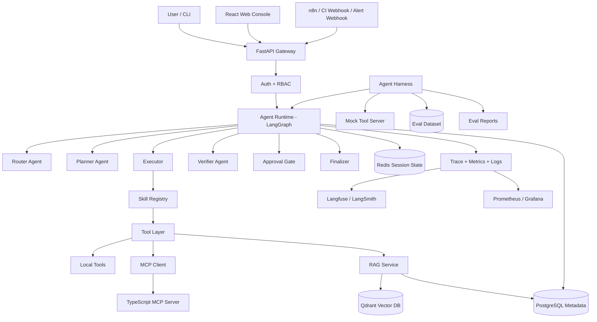
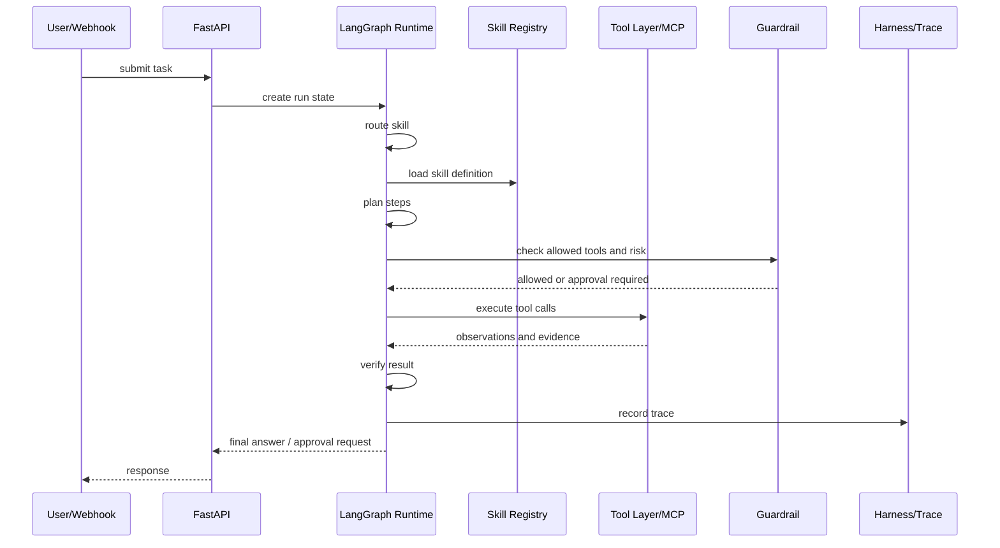
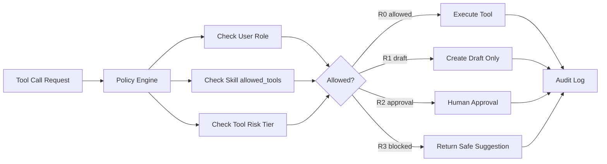
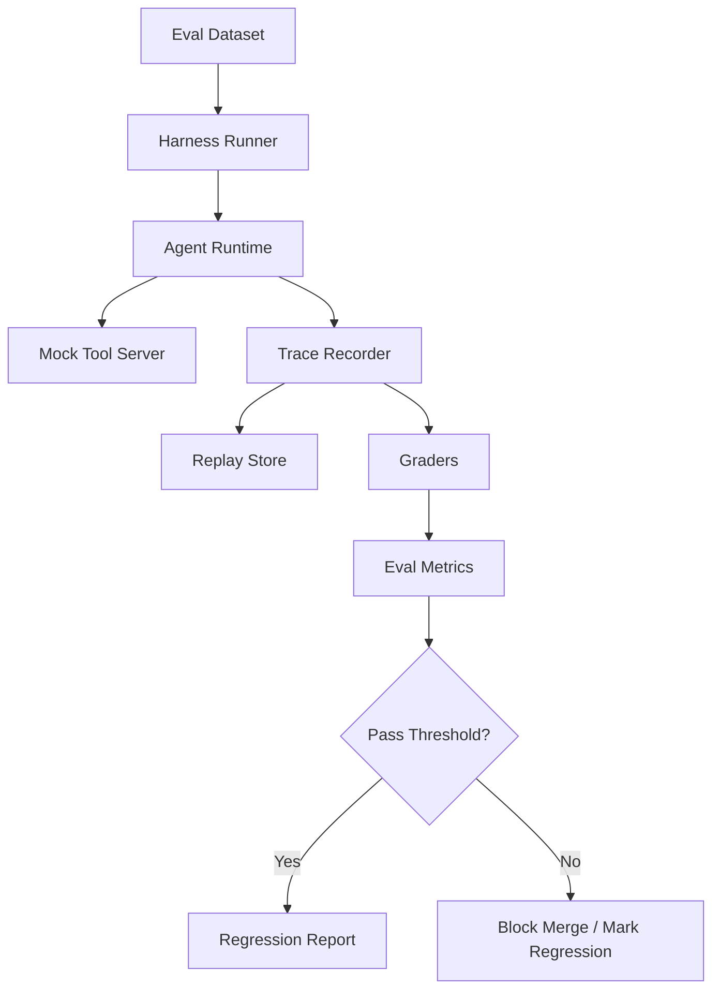

# 企业级研发与运维智能体运行平台 PRD

> 项目定位：面向 AI Agent 开发实习岗位的工业级作品集项目。目标不是做一个聊天机器人，而是做一个能连接企业研发系统、拆解任务、调用工具、受权限约束、可评测、可观测、可回放的 Agent Runtime。

## 1. 文档信息

| 项目 | 内容 |
|---|---|
| 产品名 | AI Native DevInfra Agent Platform |
| 中文名 | 企业级研发与运维智能体运行平台 |
| 目标用户 | 研发工程师、SRE、测试、技术负责人、平台管理员 |
| 目标岗位 | AI Agent 开发实习生、Agent Harness Engineering、AI 应用开发实习生、AIOps Agent、研发效能 Agent |
| 核心场景 | CI/CD 失败排查、线上告警初筛、需求/Issue 拆解、文档/代码/Runbook 检索 |
| 核心能力 | Skills、MCP、Tool Calling、任务拆解、权限控制、上下文管理、Agent Harness、评测、可观测、生产部署 |

## 2. 背景与机会

从岗位要求看，企业真实需求已经从“做一个 LLM Demo”转向“把 Agent 接入真实工作流”。高频关键词包括：

- `工作流 Agent 化`：研发、产品、算法、运维流程里的重复工作自动化。
- `工具调用`：让模型能调用 Git、CI、日志、监控、文档、工单等系统。
- `RAG / 上下文工程`：让 Agent 通过企业知识和系统状态做判断，而不是凭空回答。
- `MCP / 系统集成`：用标准协议把模型能力和企业基础设施连接起来。
- `评测与可观测`：通过 trace、replay、eval 判断 Agent 是否真的变好。
- `权限与安全`：高风险操作必须可控、可审计、可回滚。

官方生态也在向这个方向收敛：

- OpenAI Agents SDK 把 orchestration、guardrails、state、observability、eval 都放进 Agent 开发链路。
- OpenAI Tools 文档把 function calling、MCP、skills、file search、shell 等能力统一放到工具体系下。
- MCP 官方把协议定位为 AI 应用连接外部工具和数据源的标准方式。
- LangGraph 定位为 long-running、stateful agents 的 orchestration runtime，强调 persistence、human-in-the-loop、memory 和生产部署。
- LangSmith / Langfuse 类工具强调 trace、evaluation、monitoring 和 failure analysis。

因此，本项目选择“研发与运维基础设施 Agent 平台”作为场景：它能自然覆盖招聘中最常见的技能栈，也能展示候选人进入团队后可以直接参与 workflow、tool、MCP、RAG、eval、observability、production 的能力。

## 3. 产品目标

### 3.1 北极星目标

让研发团队在遇到 CI 失败、线上告警、需求拆解和知识检索问题时，可以通过一个受控的 Agent Runtime 自动收集上下文、拆解任务、调用工具、生成证据化结论，并通过 Agent Harness 持续评测和回放每次改动。

### 3.2 成功指标

| 指标 | P0 目标 | 解释 |
|---|---:|---|
| 任务路由准确率 | >= 85% | 能把用户请求分到正确 workflow 或 skill |
| 工具选择准确率 | >= 80% | Agent 调用的工具与任务目标匹配 |
| RAG 引用命中率 | >= 75% | 回答中引用的文档或代码片段能支持结论 |
| 高风险操作拦截率 | 100% | 写操作、回滚、创建 PR 等必须进入审批 |
| Eval 回归通过率 | >= 90% | 修改 prompt、skill、tool 后不能明显退化 |
| P95 响应时间 | <= 30s | P0 演示版可接受，长任务异步执行 |
| Trace 覆盖率 | 100% | 每次运行必须记录模型调用、工具调用、审批与结果 |

## 4. 目标用户与核心痛点

| 用户 | 痛点 | Agent 价值 |
|---|---|---|
| 后端研发 | CI 失败、日志很长、定位慢 | 自动读取日志、关联变更、生成修复建议 |
| SRE | 告警频繁、上下文分散 | 关联指标、日志、Runbook、历史事故 |
| 测试工程师 | 不知道改动影响哪些测试 | 根据 diff 和文档生成测试清单 |
| 技术负责人 | 需求拆解质量不稳定 | 自动生成实现计划、风险点和验收标准 |
| 平台管理员 | 担心 Agent 乱操作 | RBAC、审批、审计、回放和权限边界 |

## 5. 产品范围

### 5.1 P0 必做

- 支持 4 条核心工作流：CI 失败排查、线上告警初筛、Issue 拆解、Runbook/代码检索。
- 实现最小 Web Console：提交任务、查看 run trace、处理审批、查看 eval summary。
- 实现 `Agent Runtime`：router、planner、executor、verifier、finalizer。
- 实现 `Skill Registry`：用结构化配置注册 skill。
- 实现 `Tool Layer`：至少 8 个工具，覆盖 Git、CI、日志、指标、文档、工单、代码搜索、通知。
- 实现 `MCP Server + MCP Client`：至少一个 TypeScript MCP server 暴露工具。
- 实现 `RAG`：文档切分、embedding、向量检索、引用证据。
- 实现 `Permission / Guardrail`：RBAC、risk tier、approval gate、audit log。
- 实现 `Agent Harness`：任务数据集、mock 外部系统、trace replay、自动评分、回归测试。
- 实现 `Observability`：trace、structured logs、metrics、dashboard。
- 实现 `Production 基础`：Docker Compose、GitHub Actions、health check、retry、timeout、rate limit。

### 5.2 P1 增强

- 支持 n8n webhook 作为告警/CI 入口。
- 支持 Slack/飞书机器人入口。
- 支持 Dify 作为对照组接入。
- 支持 LangSmith 或 Langfuse 云端 trace。
- 支持多模型 fallback。
- 支持人工反馈进入 eval dataset。
- Web Console 增强：Skill / Tool Registry 查看、知识库导入、失败案例标注、指标趋势页。

### 5.3 P2 展示

- React Flow 展示 Agent 状态图和工具调用图。
- Prometheus + Grafana 指标面板。
- LlamaIndex RAG adapter。
- FAISS 本地 fallback。
- 自动创建 GitHub PR 的审批后执行流程。

### 5.4 明确不做

- 不做完整企业账号体系，只做 JWT + RBAC 演示。
- 不连接真实生产系统，使用本地 fixture 和 mock service 演示。
- 不让 Agent 自动执行高风险写操作。
- 不做大模型微调，重点在 Agent 工程化。
- 不追求覆盖所有业务域，只覆盖研发与运维这一类高价值内部流程。

## 6. 核心场景

### 6.1 场景 A：CI/CD 失败排查

输入：

- GitHub Actions job URL 或失败日志。
- PR diff。
- 最近提交信息。

处理流程：

1. Router 判断为 `triage_ci_failure` skill。
2. Planner 拆成：读取日志、定位失败阶段、关联 diff、检索历史故障、生成修复建议。
3. Executor 调用 `ci_log_tool`、`git_diff_tool`、`code_search_tool`、`runbook_search_tool`。
4. Verifier 检查是否有证据引用、是否误判、是否需要更多上下文。
5. Guardrail 判断是否涉及写操作。
6. Finalizer 输出：失败原因、证据、建议修复步骤、测试清单。

输出：

- 失败类型：依赖安装失败、单测失败、lint 失败、配置错误、环境问题。
- 证据引用：日志行、diff 文件、相关 runbook。
- 修复建议：只读建议默认输出，写操作需要审批。
- 评测标签：routing、tool_choice、evidence_quality、final_answer_quality。

### 6.2 场景 B：线上告警初筛

输入：

- 告警标题。
- 服务名。
- 时间窗口。
- 指标快照。

处理流程：

1. Router 判断为 `analyze_incident_alert` skill。
2. Planner 拆成：读取指标、检索相关日志、查询近期变更、检索 Runbook、生成假设。
3. Executor 调用 `metrics_tool`、`log_search_tool`、`deploy_history_tool`、`runbook_search_tool`。
4. Verifier 要求输出至少 2 个 root cause hypotheses，并标注置信度。
5. Approval Gate 阻止自动回滚，只允许生成回滚建议。

输出：

- 事故摘要。
- 可能原因及证据。
- 下一步排查 checklist。
- 建议升级对象。
- 是否需要人工介入。

### 6.3 场景 C：Issue 到实施计划

输入：

- 产品需求或 GitHub Issue。
- 相关代码仓库。
- 验收标准。

处理流程：

1. Router 判断为 `issue_to_implementation_plan` skill。
2. Planner 拆成：需求澄清、相关模块检索、影响面分析、任务拆解、测试计划生成。
3. Executor 调用 `repo_map_tool`、`code_search_tool`、`doc_search_tool`、`test_discovery_tool`。
4. Verifier 检查是否覆盖 API、数据模型、测试、风险。

输出：

- 实施计划。
- 文件级影响面。
- 测试清单。
- 风险与未决问题。
- 推荐拆分任务。

### 6.4 场景 D：Runbook / 文档 / 代码检索

输入：

- 自然语言问题。
- 可选服务名、仓库名、环境。

处理流程：

1. Router 判断为 `retrieve_engineering_context` skill。
2. Executor 先走 hybrid search，再做 rerank。
3. Finalizer 输出带 citation 的答案。
4. Harness 对 citation correctness 做评分。

输出：

- 简洁答案。
- 引用来源。
- 相关文档和代码位置。
- 可信度和缺失上下文。

## 7. 功能需求

### 7.1 Agent Runtime

Runtime 是主执行引擎，负责把自然语言请求变成可控的工作流执行。

| 模块 | 职责 |
|---|---|
| Router | 判断任务类型，选择 skill |
| Planner | 拆解任务步骤，生成执行计划 |
| Executor | 根据计划调用 tools、MCP tools、RAG |
| Verifier | 检查证据、格式、风险、是否需要重试 |
| Handoff | 将子任务交给 specialist agent |
| Approval Gate | 高风险操作暂停，等待人工审批 |
| Finalizer | 汇总证据、结论、下一步动作 |

### 7.2 Skill Registry

Skill 是可复用任务能力，不是简单 prompt。每个 skill 必须结构化注册。

```yaml
name: triage_ci_failure
description: Analyze failed CI runs and produce evidence-based fix plans.
input_schema:
  ci_run_id: string
  repo: string
  pr_number: integer
allowed_tools:
  - github.get_pr_diff
  - ci.get_failed_logs
  - repo.search_code
  - rag.search_runbook
risk_level: read_only
requires_approval: false
output_schema:
  failure_type: string
  evidence: list
  fix_plan: list
  test_plan: list
fallback_policy: ask_for_more_context
eval_tags:
  - routing
  - tool_choice
  - evidence_quality
```

Skill 设计原则：

- 一个 skill 对应一个清晰业务任务。
- skill 声明允许调用的工具，不能任意调用全局工具。
- skill 必须声明风险等级和审批策略。
- skill 版本变更必须进入 eval 回归。

### 7.3 Tool Layer

工具分为三类。

| 类型 | 示例 | 用途 |
|---|---|---|
| Local Tools | log parser、code grep、json parser | 低延迟、可测试的本地处理 |
| Service Tools | GitHub、CI、Jira、Prometheus | 连接企业系统 |
| MCP Tools | TypeScript MCP server 暴露的 repo/ci/docs 工具 | 标准化外部工具接入 |

P0 工具清单：

| 工具 | 能力 |
|---|---|
| `github.get_pr_diff` | 获取 PR diff |
| `github.get_recent_commits` | 获取最近提交 |
| `ci.get_failed_logs` | 获取失败 job 日志 |
| `repo.search_code` | 搜索代码片段 |
| `rag.search_runbook` | 检索 Runbook / 文档 |
| `logs.search_service_logs` | 检索服务日志 |
| `metrics.query_timeseries` | 查询指标快照 |
| `ticket.create_draft` | 创建待审批工单草稿 |

### 7.4 MCP 集成

MCP server 用 TypeScript 实现，暴露以下工具：

- `get_repo_file`
- `search_repo`
- `get_ci_run`
- `get_runbook`
- `create_ticket_draft`

MCP client 由 Python Runtime 调用。这样可以展示：

- Agent 不直接绑定某个系统 SDK。
- 工具能力可以由独立服务提供。
- 后续可替换为真实 GitHub、GitLab、Jira、Confluence、Prometheus。

### 7.5 Agent Harness

Agent Harness 是本项目的关键差异化能力。它不是 Runtime 本身，而是用来构造任务、执行回放、打分、调试和回归的实验平台。

Harness 组成：

| 模块 | 职责 |
|---|---|
| Scenario Fixtures | 保存 CI 失败、告警、Issue、Runbook 检索的固定输入 |
| Mock Tool Server | 模拟 GitHub、CI、日志、指标、工单系统 |
| Trace Recorder | 记录 router、planner、tool calls、guardrails、final answer |
| Replay Engine | 用相同输入重跑不同 prompt、skill、model 或 tool 版本 |
| Grader | 自动评分：工具选择、证据质量、答案质量、安全性 |
| Regression Gate | PR 中自动跑 eval suite，低于阈值则失败 |
| Failure Taxonomy | 归类失败：路由错、工具错、检索错、幻觉、权限违规 |

Runtime 与 Harness 的区别：

| 项目 | Runtime | Harness |
|---|---|---|
| 目标 | 处理真实任务 | 验证系统效果 |
| 输入 | 用户请求、告警、CI 事件 | 固定测试集和历史 trace |
| 输出 | 结论、计划、审批请求 | 指标、失败原因、回归结果 |
| 使用者 | 研发、SRE、平台用户 | Agent 开发者、评测负责人 |

### 7.6 上下文管理

上下文分四层管理。

| 层级 | 存储 | 内容 | 生命周期 |
|---|---|---|---|
| Working Context | LangGraph state | 当前任务计划、工具结果、证据包 | 单次 run |
| Session Memory | Redis | 用户当前会话、未完成审批、短期偏好 | 小时到天 |
| Long-term Memory | PostgreSQL | 历史 run、失败归因、用户反馈、审批记录 | 长期 |
| Knowledge Context | Qdrant + Postgres | 文档、Runbook、代码说明、事故复盘 | 长期 |

上下文裁剪策略：

- Planner 只接收任务目标和必要摘要。
- Executor 按步骤拉取工具所需上下文。
- Finalizer 接收 evidence pack，而不是完整日志。
- 长日志先本地解析，再把关键片段交给模型。
- RAG 结果必须保留 source id、chunk id、score。
- 超 token 时按优先级保留：用户目标、审批状态、证据、失败信息、历史摘要。

### 7.7 权限与安全

权限系统采用 RBAC + risk tier + approval gate。

角色：

| 角色 | 权限 |
|---|---|
| Viewer | 只能问答、检索、查看 trace |
| Developer | 可运行 read-only 诊断工具，可创建草稿 |
| Maintainer | 可审批创建 PR、创建工单、触发低风险操作 |
| Admin | 管理工具、skill、策略、密钥 |

风险等级：

| 等级 | 示例 | 策略 |
|---|---|---|
| R0 read-only | 读日志、读 PR、查文档 | 自动执行 |
| R1 draft-only | 创建工单草稿、生成 PR 草稿 | 自动生成草稿，不提交 |
| R2 approval-required | 创建真实 PR、触发重跑 CI | 人工审批后执行 |
| R3 blocked | 生产回滚、删除资源、修改权限 | P0 仅输出建议 |

Guardrail 规则：

- Skill 只能调用 `allowed_tools` 中的工具。
- Tool 调用前检查 user role、risk_level、resource scope。
- 任何写操作必须带 idempotency key。
- 所有工具调用写入 audit log。
- Final answer 必须标注哪些建议可自动执行、哪些需要人工确认。

### 7.8 评测体系

P0 eval dataset 至少 60 条：

- CI 失败排查 20 条。
- 告警初筛 15 条。
- Issue 拆解 15 条。
- 文档/代码检索 10 条。

评分维度：

| 维度 | 判断标准 |
|---|---|
| Routing Accuracy | 是否选对 skill |
| Plan Quality | 拆解步骤是否完整、顺序是否合理 |
| Tool Precision | 是否调用了必要工具，是否避免多余工具 |
| Evidence Quality | 结论是否有日志、代码、文档、指标支持 |
| Safety Compliance | 是否拦截高风险操作 |
| Answer Usefulness | 输出是否能指导工程师下一步行动 |
| Latency / Cost | 是否在预算内完成 |

Grader 组合：

- Rule-based grader：检查结构、字段、引用、权限。
- LLM-as-judge：判断解释质量和计划质量。
- Golden answer match：对固定 case 检查关键事实。
- Human feedback：手动标注失败 case，进入回归集。

### 7.9 可观测性

每次 run 必须记录：

- request id、user id、role、skill、model、prompt version。
- router decision。
- planner steps。
- tool calls、参数、耗时、成功率、错误。
- MCP server request/response。
- retrieved chunks、source、score。
- guardrail decision。
- approval state。
- final answer。
- token usage、cost、latency。

Dashboard 指标：

- 任务成功率。
- 各 skill 调用量。
- 工具失败率。
- 平均工具调用次数。
- P50/P95 latency。
- approval rate。
- fallback rate。
- eval regression trend。
- top failure categories。

### 7.10 Web Console

前端定位是工程操作台，不是营销页或聊天玩具。它负责把 Runtime、Harness、权限和可观测能力可视化，让面试官能在 5 分钟内看到系统的工业化闭环。

P0 页面：

| 页面 | 核心功能 | 展示价值 |
|---|---|---|
| Run Workbench | 提交 CI 日志、告警、Issue 或检索问题；选择 workflow；查看输出 | 证明 Agent 能处理真实任务 |
| Run Trace Detail | 展示 router、planner、tool calls、RAG chunks、guardrail、final answer | 证明可解释、可调试 |
| Approval Queue | 查看待审批动作，批准或拒绝，记录理由 | 证明权限和 human-in-the-loop |
| Eval Dashboard | 运行 eval suite，展示通过率、失败分类、回归趋势 | 证明 Agent Harness |

P1 页面：

| 页面 | 核心功能 | 展示价值 |
|---|---|---|
| Skill Registry | 查看 skill 定义、版本、allowed tools、risk level | 证明 skill 体系 |
| Tool Registry | 查看 local tools、service tools、MCP tools 的状态和 schema | 证明工具治理 |
| Knowledge Base | 上传 Runbook / Markdown 文档，查看 chunk 和检索测试 | 证明 RAG 工程化 |
| Failure Lab | 查看失败 case，标注失败原因，加入回归集 | 证明持续迭代 |
| System Health | 查看服务状态、队列、Qdrant、Redis、Postgres、MCP server | 证明生产意识 |

前端交互原则：

- 首屏直接进入 Run Workbench，不做 landing page。
- Trace 页按时间线展示步骤，关键字段可展开。
- Tool call 参数默认折叠，避免泄露敏感信息。
- 高风险动作在 Approval Queue 中必须展示风险等级、调用工具、参数摘要和 evidence。
- Eval Dashboard 只展示和改进有关的指标：routing、tool precision、evidence quality、safety、usefulness。
- 前端不直接调用外部系统，只调用 FastAPI Gateway。

## 8. 技术架构

### 8.1 总体架构图



### 8.2 Runtime 执行流



### 8.3 权限控制流



### 8.4 Agent Harness 流程



## 9. 数据模型

| 表 | 关键字段 | 用途 |
|---|---|---|
| `users` | id, role, team | 用户与权限 |
| `skills` | name, version, schema, allowed_tools, risk_level | Skill 注册 |
| `runs` | id, user_id, skill, status, model, prompt_version | 任务运行 |
| `run_steps` | run_id, step_type, input, output, latency | 运行步骤 |
| `tool_calls` | run_id, tool_name, args, result, status, latency | 工具调用 |
| `approvals` | run_id, action, approver, status | 审批记录 |
| `audit_logs` | actor, action, resource, risk, decision | 审计 |
| `documents` | doc_id, source, content_hash, metadata | 文档元数据 |
| `chunks` | chunk_id, doc_id, text, vector_id | RAG chunk |
| `eval_cases` | case_id, skill, input, expected, tags | 评测样本 |
| `eval_runs` | eval_id, git_sha, model, score, report | 评测结果 |

## 10. API 设计

| Method | Path | 用途 |
|---|---|---|
| POST | `/api/runs` | 创建 Agent 任务 |
| GET | `/api/runs/{run_id}` | 查询任务状态和结果 |
| GET | `/api/runs/{run_id}/trace` | 查看 trace |
| GET | `/api/runs/{run_id}/events` | SSE 流式返回 run 事件 |
| POST | `/api/approvals/{approval_id}` | 审批高风险动作 |
| GET | `/api/approvals` | 查看待审批队列 |
| GET | `/api/skills` | 查看 skill registry |
| GET | `/api/tools` | 查看 tool registry 和健康状态 |
| POST | `/api/tools/test` | 测试工具连通性 |
| POST | `/api/ingest/docs` | 导入文档和 Runbook |
| POST | `/api/evals/run` | 运行 eval suite |
| GET | `/api/evals/{eval_id}` | 查看评测报告 |
| GET | `/api/health/components` | 查看 Postgres、Redis、Qdrant、MCP server 状态 |
| GET | `/healthz` | 健康检查 |
| GET | `/readyz` | 就绪检查 |

## 11. 技术选型摘要

| 技术 | 用途 | 选择原因 |
|---|---|---|
| Python | 主开发语言 | 岗位高频要求，生态完整 |
| FastAPI | API Gateway | 类型友好、异步支持好、适合服务化 |
| React + TypeScript + Vite | Web Console | 工程控制台场景成熟，开发速度快，类型约束清晰 |
| TanStack Query | 前端数据请求和缓存 | 适合 run、trace、approval、eval 等服务端状态 |
| React Router | 前端路由 | 控制台多页面需要清晰导航 |
| Recharts / ECharts | Eval 和系统指标图表 | 快速展示趋势、分布和失败分类 |
| React Flow | Agent 图和工具调用图 | P2 展示 workflow 和 trace graph |
| LangGraph | Agent Runtime | 支持状态流、human-in-the-loop、长任务和持久化 |
| MCP SDK | 标准工具接入 | 对齐企业系统集成趋势 |
| TypeScript | MCP server | 展示第二语言能力，适合工具服务 |
| Qdrant | 向量数据库 | 本地部署简单，适合 RAG 演示 |
| PostgreSQL | 元数据和审计 | 结构化数据、评测记录、审计记录可靠 |
| Redis | Session state / queue | 短期状态、缓存、分布式锁 |
| Langfuse / LangSmith | Observability | Trace、eval、prompt 版本、线上监控 |
| Docker Compose | 本地生产化部署 | 一键拉起依赖 |
| GitHub Actions | CI/CD | 展示自动化测试和 eval gate |
| Prometheus/Grafana | 系统指标 | 展示生产观测意识 |

## 12. 面试问答准备

### Q1：为什么这个场景适合用 Agent，而不是普通脚本？

因为 CI 失败、事故排查、需求拆解都不是固定流程。它们需要动态收集上下文、判断下一步该查什么、调用不同工具、根据结果继续调整计划。脚本适合稳定输入和固定路径，Agent 适合“目标明确但路径不固定”的任务。

### Q2：上下文怎么管理？

分四层：LangGraph state 保存单次 run 的工作上下文；Redis 保存短期会话和审批状态；PostgreSQL 保存长期运行记录、审批和反馈；Qdrant 保存文档、Runbook、代码说明的向量索引。模型只看到 evidence pack 和必要摘要，不直接塞完整日志。

### Q3：如何防止 Agent 乱调用工具？

每个 skill 声明 `allowed_tools`，每个 tool 声明 risk tier。执行前经过 policy engine 检查用户角色、skill 范围、资源范围和风险等级。R0 只读工具可自动执行，R2 写操作必须审批，R3 生产高危操作在 P0 只输出建议。

### Q4：MCP 在项目里解决什么问题？

MCP 把外部系统能力变成标准工具接口。Runtime 不需要直接耦合 GitHub、CI、文档系统的 SDK，而是通过 MCP client 调用 MCP server 暴露的工具。这样工具可以独立部署、独立授权、独立替换。

### Q5：Skill 和 Tool 的区别是什么？

Tool 是原子能力，例如读 PR diff、查日志、检索文档。Skill 是面向任务的可复用工作流能力，例如 CI 失败排查。Skill 会声明输入输出、允许工具、风险等级、fallback 和 eval 标签。

### Q6：Agent Harness 和普通测试有什么区别？

普通测试检查函数是否按预期返回。Agent Harness 检查一个完整 Agent workflow：路由是否正确、计划是否合理、工具是否选对、证据是否支持结论、权限是否拦截、输出是否对工程师有用。它还支持 trace replay 和回归比较。

### Q7：如何评测 Agent 效果？

用固定 eval dataset 跑回归。评分包括 routing accuracy、tool precision、evidence quality、safety compliance、answer usefulness、latency 和 cost。grader 由规则检查、golden answer、LLM-as-judge 和人工反馈组成。

### Q8：可观测性看什么？

看每次 run 的 trace，包括 router 决策、planner 步骤、tool calls、MCP 调用、RAG chunk、guardrail decision、approval state、final answer、token、cost 和 latency。线上还要看任务成功率、工具失败率、fallback rate 和 eval trend。

### Q9：生产环境最担心什么？

最担心误操作、不可复现和效果退化。解决方式是：高风险审批、audit log、idempotency key、trace replay、eval gate、限流、超时、重试、熔断、版本化 prompt/skill/tool。

### Q10：LangGraph 为什么适合这个项目？

它适合长任务、有状态、多步骤、需要 human-in-the-loop 的 Agent workflow。CI 排查和事故初筛都需要保存中间状态、等待审批、失败重试和回放，普通链式调用不够。

### Q11：RAG 失败怎么排查？

先看 query 是否改写错误，再看 chunk 是否过大或过小，再看 embedding 检索召回是否命中，再看 rerank 是否把正确结果排前，再看 final prompt 是否正确使用 citation。失败样本要进入 eval dataset。

### Q12：如何处理模型幻觉？

强制 final answer 引用 evidence pack；没有证据就输出“不足以判断”。Verifier 检查结论是否有 source id。对工具结果和 RAG 引用做结构化约束，避免模型自由编造。

## 13. 四周交付路线

| 周 | 目标 | 交付物 |
|---|---|---|
| 第 1 周 | Runtime + Skill + 基础工具 | FastAPI、LangGraph、Skill Registry、CI 失败排查 P0 |
| 第 2 周 | RAG + MCP + 权限 | Qdrant、MCP server、RBAC、approval gate |
| 第 3 周 | Agent Harness + Eval + Observability | eval dataset、replay、grader、trace、dashboard |
| 第 4 周 | 前端控制台 + 生产化 + 包装 | React Console、Docker Compose、GitHub Actions、README、Demo、简历材料 |

## 14. 作品集交付物

- GitHub 仓库。
- Web Console Demo。
- README：架构图、运行方式、Demo 截图、eval 结果。
- PRD 文档。
- 技术学习文档。
- 2 到 3 分钟 Demo 视频脚本。
- Eval report。
- 失败案例复盘。
- 面试讲解稿。

## 15. 参考资料

- OpenAI Agents SDK: https://developers.openai.com/api/docs/guides/agents
- OpenAI Tools: https://developers.openai.com/api/docs/guides/tools
- OpenAI Evals: https://developers.openai.com/api/docs/guides/evals
- Model Context Protocol: https://modelcontextprotocol.io/docs/getting-started/intro
- LangGraph Overview: https://docs.langchain.com/oss/python/langgraph/overview
- LangSmith Observability: https://docs.langchain.com/langsmith/observability
- LangSmith Evaluation: https://docs.langchain.com/langsmith/evaluation
